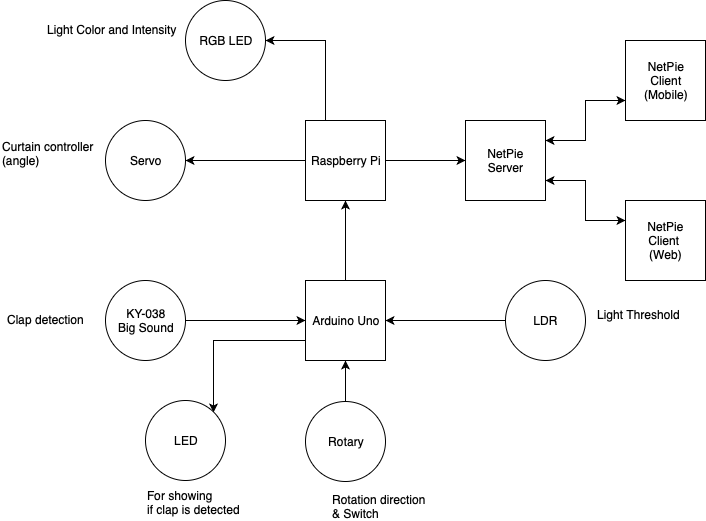
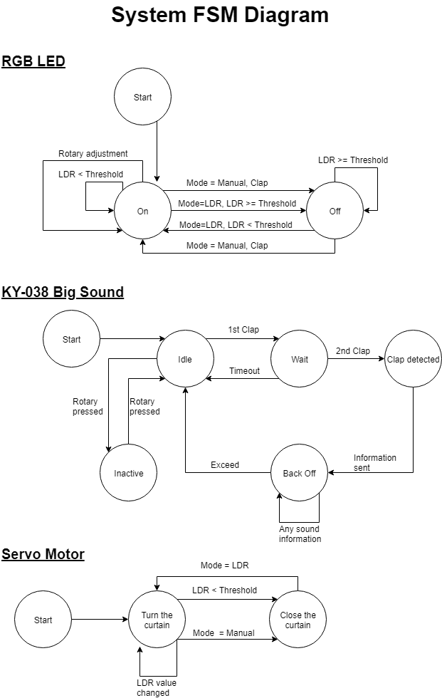

# IoT Automatic Brightness Adjustment System

A simulated system to control brightness in the room by turning the curtain to a specific angle depending on the intensity of the sunlight or the environment outside. If the intensity is lower than a threshold, the system will close the curtain and turn on light bulbs automatically. This system will help users control the brightness in the room automatically and the users can also control the system manually to turn on the light bulbs by clapping their hands. This system also provides NETPIE interface for adjusting the brightness and colors of the light bulbs.

## Objectives

1. To make an automatic system that reduces energy consumption from electrical light sources
2. To make it easier for users to control the brightness in each room, both automatically and manually by clapping

## Scenarios

### LDR Mode

People usually turn off the lights and open the curtain in their house during a day because there is enough sunlight for them to see things. Conversely, in the nighttime, we need to turn on the lights or we could not see things easily otherwise. Rather than spending an additional time turning on or off the light sources and opening or closing the curtain manually, LDR mode can perform this task automatically and seamlessly by determining the intensity of the sunlight outside. Furthermore, when the lights are on, they can be dimmed easily by turning the rotary encoder knob.

### Manual Mode

We may also turn on the lights during the day, especially in the room under the shade. By switching to manual mode with a button, we can clap to toggle the light sources at will. For example, a person that works in an office will need more light to work easier. Just like in LDR Mode, the rotary encoder can be turned in order to dim or increase the brightness of the light sources.

## Design

In this system, Arduino Uno controls all the sensors (Big Sound or KY-038, Rotary Encoder and LDR) and sends the data received from them to the Raspberry Pi. Raspberry Pi receives the data and issues the tasks to its connected actuators (RGB LED and Servo) accordingly. Independent RGB LED values and Servo motor angle (curtain angle) are then submitted to the NETPIE server. A desktop client running NETPIE Freeboard on a web browser can see and adjust those values from the web interface. A mobile client running NETPIE can also do the same thing.

### Schematic

### Finite State Machine Diagram

## Installation and configurations

### Hardwares
In order to make the system works, the following steps are needed to be done:
1. Prepare the following components
   - 1 Arduino UNO
   - 1 Raspberry Pi 3 Model B+
   - 1 Light Dependent Resistor (LDR)
   - 1 Big Sound Sensor Module (KY-038)
   - 1 Rotary Encoder Module (KY-040)
   - 1 Servo Motor
   - 1 RGB LED
   - 1 LED
   - 5 Resistors (220Ω)
   - 1 Breadboard
   - Wires
2. Connect your machine to Arduino UNO via USB, and use Arduino IDE to open and upload
“IoTBrightnessAdjustmentArduino.ino” to it
3. Configure your Raspberry Pi 3 Model B+ to connect to your access point
4. Connect to Raspberry Pi 3 Model B+ (with Raspbian or Linux-based OS) via SSH or SCP and
upload “IoTBrightnessAdjustmentPi.py” to it
5. Connect the components together according to the schematic
6. Plug the Raspberry Pi 3 Model B+ to the power source
7. Connect to Raspberry Pi 3 Model B+ via SSH, go to the directory with the uploaded “IoTBrightnessAdjustmentPi.py”, and run the Python code with the command “sudo python IoTBrightnessAdjustmentPi.py”
8. You can now use the system
 
### NETPIE
To use NETPIE to control the system, the following steps are needed to be done:
1. Go to https://netpie.io/ and register for a NETPIE account
2. Go to https://netpie.io/app and create a new application
3. Go to https://netpie.io/app/ [Your application name] and create a new application key
4. Go to https://netpie.io/freeboard and create a new Freeboard
5. On your new Freeboard, press “Import” and select “NETPIEFreeboard.json” to import the configuration of the Freeboard
6. Edit themkey, secret, and application id of your datasource to match the key you have created
7. Edit “IoTBrightnessAdjustmentPi.py” on your Raspberry Pi and change “gearkey”, “gearsecret:, and “appid” to match
the key you have created
1. With the “IoTBrightnessAdjustmentPi.py” Python file, you can use the Freeboard to control the system

## Authors
* **Thatchapon Unprasert** - [PoomSmart](https://github.com/PoomSmart)
* **Weerawat Pawanawiwat** - [ErbaZZ](https://github.com/ErbaZZ)
* **Dawit Chusetthagarn** - [dawit-chu](https://github.com/dawit-chu)